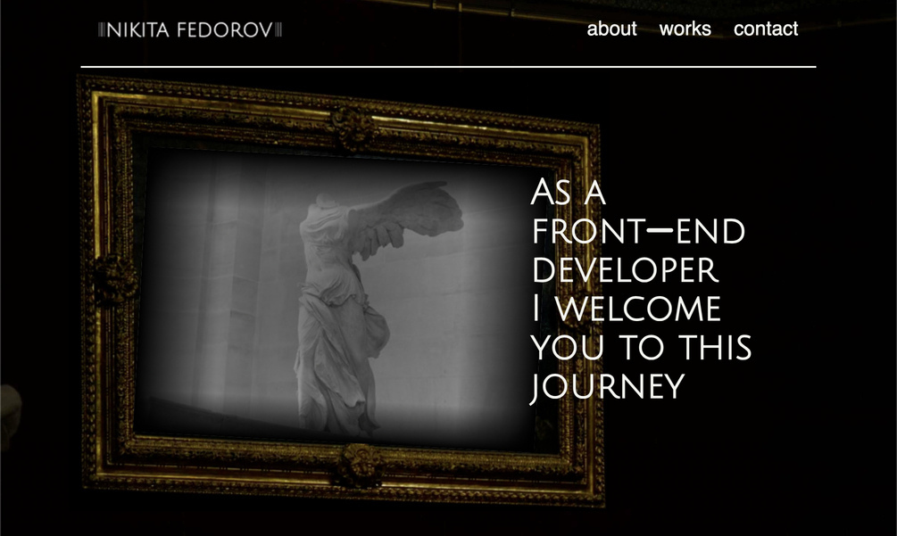

# My Portfolio Website

My own portfolio website is for you to look through my progress and maybe eventually decide to get me onboard of whatever cool idea or project you have going on. The website focuses on the academic progress of my acquired skills.
  

Explore the website by visiting the link - [My Portfolio](https://nikitas-portfolio.netlify.app/)

## Key Features

- Home Page displaying every aspect needed, being the only page available.
   
- Page build using JS, HTML and CSS with no all code being my own

<h3>Built With</h3>
- Visual Studio Code

<h3>Getting Started</h3>
<h4>Installing:</h4>
 
1.Clone the repo:
git clone git@github.com:NoroffFEU/portfolio-1-example.git
 
Install the dependencies:
##
<tab><tab>npm install

<h4>Running</h4>
To run the app, run the following commands:
 
npm run start

<h3>Future Improvements</h3>
-Changing the images and how the react in the Selected Projects part in the middle of the page
 
-Make the website respond better on mobile phones
 
-Change the margins and sizes of some of the areas

<h3>Contact</h3>
You can always contact me though email or my phone number.

nikita151998@gmail.com
 
+4745588474

<h4>Acknowledgments</h4>
I would like to thank my mentor Connor Obrien for giving me ideas on how to make the frame and images in the frame move together without using javascript.
